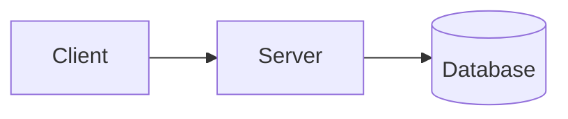

# The Pipeline

A personal technical blog and writing platform. Articles live as Markdown files in the repository — no database, no CMS, no admin panel. The server renders Markdown to HTML on demand, generates diagrams server-side, and produces an RSS feed for subscribers.

## Features

- **Markdown-based content**: Drop a `.md` file into `content/posts/` and it becomes an article.
- **Mermaid diagrams**: Embed diagrams directly in Markdown with fenced code blocks. Rendered server-side to SVG and cached.
- **Server-rendered SVG diagrams**: Click any diagram to view fullscreen. Diagrams are cached on disk after first render.
- **RSS feed**: Auto-generated at `/rss.xml` from the current articles.
- **Sitemap**: Auto-generated at `/sitemap.xml` for search engines.
- **Syntax-highlighted code blocks**: With `<pre><code class="language-X">` blocks.
- **Front matter**: Each article declares its title, description, date, tags, and draft status.
- **Zero JS framework**: The frontend is plain HTML, CSS, and a small JS file for the diagram fullscreen modal.
- **No database**: Everything derives from the filesystem.

## Quick Start

```bash
# 1. Clone
git clone https://github.com/your-username/the-pipeline.git
cd the-pipeline

# 2. Create a virtual environment
python3 -m venv .venv
source .venv/bin/activate

# 3. Install dependencies
pip install fastapi uvicorn python-frontmatter pyyaml playwright

# 4. Install Chromium for Mermaid rendering
.venv/bin/playwright install chromium

# 5. Run the server
.venv/bin/uvicorn serve:app --host 0.0.0.0 --port 8000

# 6. Open in your browser
open http://localhost:8000
```

The server listens on port 8000 by default.

## Writing an Article

Create a `.md` file in `content/posts/` with the following front matter:

```markdown
---
title: "Your Article Title"
description: "A one-sentence description for SEO and the listing page."
date: 2026-06-15
tags: [architecture, kafka, python]
draft: false
---

# Heading 1

Your content starts here. Standard Markdown syntax is supported:

- Lists
- **Bold** and *italic*
- `inline code`
- [links](https://example.com)
- > blockquotes
- Tables

## Code Blocks

```python
def hello():
    return "world"
```

## Diagrams

Use fenced code blocks with `mermaid` as the language. Server-side rendered:


```

Articles with `draft: true` are excluded from listings, RSS, and sitemap. Set `draft: false` to publish.

## Project Structure

```
.
├── app/
│   ├── server.py            FastAPI entry point
│   ├── markdown.py           Markdown → HTML compiler with Pygments
│   ├── mermaid_renderer.py  Playwright-based Mermaid → SVG (in-memory cached)
│   ├── cache.py              Thread-safe in-memory caches
│   ├── config.py            Env var config
│   ├── templates.py          HTML page templates
│   └── static/
│       ├── style.css        Medium-style typography
│       ├── app.js           Fullscreen modal for diagrams
│       └── mermaid.min.js   Mermaid.js (local, no CDN)
├── content/
│   └── posts/               Markdown articles
├── render.yaml              Render deployment config
├── requirements.txt         Pinned Python dependencies
└── README.md
```

## How It Works

### Article Rendering

The `/blog/{slug}` route loads `content/posts/{slug}.md`, parses the front matter, and walks the Markdown body. Code blocks are extracted from the source and replaced with placeholders to preserve them through text-based Markdown processing.

For non-Mermaid code blocks, the source is HTML-escaped and wrapped in `<pre><code class="language-X">`. For Mermaid code blocks, the renderer kicks in:

1. The Markdown source is hashed (MD5) with the theme name as the cache key.
2. If a cached SVG exists at `static/diagrams/{hash}.svg`, it is returned immediately.
3. Otherwise, a headless Chromium loads a small HTML page containing Mermaid.js, the diagram code, and theme variables.
4. After Mermaid renders the diagram, the SVG XML is extracted, written to the cache file, and returned.

This means the first request for a new diagram takes about 2 seconds. Subsequent requests are instant.

Server-side rendering produces clean inline SVG. No JavaScript hydration, no client-side Mermaid library, no flash of unstyled content.

### RSS Feed

`GET /rss.xml` walks all published articles and produces an RSS 2.0 XML document with the article metadata and publication date. Articles are sorted by date descending.

### Sitemap

`GET /sitemap.xml` produces a standard sitemap with all static routes (`/`, `/blog`, `/portfolio`, `/about`) and one URL per published article.

### Frontend

The frontend is plain HTML and CSS. There is one JavaScript file (`app.js`) that handles the fullscreen modal for diagrams. Click any diagram to zoom in; press Escape or click the backdrop to close.

## Configuration

### Site Metadata

Edit the constants at the top of `serve.py`:

```python
SITE_URL = "https://thepipeline.dev"      # Production URL
SITE_TITLE = "The Pipeline"
SITE_DESC = "Articles on distributed architecture, financial systems, and AI engineering."
AUTHOR = "Manuel Tobón"
```

### Mermaid Theme

The diagram theme is defined in `mermaid_renderer.py` as `DARK_VARS` and `LIGHT_VARS`. Edit these dictionaries to change colors, fonts, and spacing.

## Deployment

The server can run anywhere Python 3.12+ runs. Some options:

### Docker

```dockerfile
FROM python:3.12-slim
WORKDIR /app
COPY requirements.txt .
RUN pip install --no-cache-dir -r requirements.txt
RUN playwright install chromium
COPY . .
EXPOSE 8000
CMD ["uvicorn", "serve:app", "--host", "0.0.0.0", "--port", "8000"]
```

### Render Auto-Deploy

Render está configurado con un webhook de GitHub — cada push a `main` redepliega automáticamente.

**Secrets requeridos en Render** (Render Dashboard → tu servicio → Environment):

Las variables de entorno están en `.env` y en `render.yaml`.

### VPS

Copy the project to your server, create the virtual environment, install dependencies and Playwright, then run uvicorn behind a reverse proxy (nginx, Caddy).

### Behind nginx

```nginx
server {
    listen 80;
    server_name thepipeline.dev;

    location / {
        proxy_pass http://127.0.0.1:8000;
        proxy_set_header Host $host;
        proxy_set_header X-Real-IP $remote_addr;
    }
}
```

## Limitations

- **No admin UI**: Articles are added by editing files and pushing to the server.
- **No incremental builds**: The server renders on each request (with Mermaid caching). For high traffic, you would add a prebuild step.
- **No comments**: If you want comments, embed Giscus via a custom HTML block in the article.
- **No search**: The article corpus is small enough that browser Ctrl+F works fine.

## License

MIT
