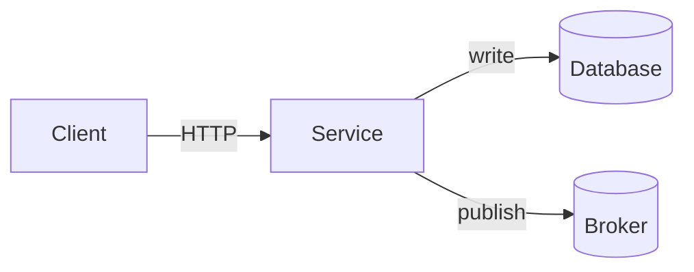

# [Paper Title Goes Here]

[Replace this line with a 1–2 sentence subtitle that frames the paper.]

[Replace this section with the Abstract section. State the problem, the approach, and the key results in 100–200 words. This is what readers see when they click the title from the listing page.]

**Index Terms** — [list 5–8 keyword terms separated by commas]

---

## 1. Introduction

[Open by framing the concrete problem this paper addresses. Avoid generic statements like "in recent years X has become important." Instead, lead with a specific scenario or constraint that motivates the work.]

[Cite prior work with bracketed numbers — the references at the bottom will resolve them. Example: "This pattern was first formalized by Kleppmann [1]." Avoid missing periods or sentences like "so first we discuss the architecture."]

[State the contributions of this paper as a numbered list:

1. [First contribution]
2. [Second contribution]
3. [Third contribution]
]

## 2. Background

[Cover the prior work, related patterns, and existing approaches. Keep paragraphs focused — one idea per paragraph. Reference external systems by name without over-explaining common knowledge.]

## 3. System Overview

[Describe the system at a high level. If a figure helps, include a Mermaid diagram right after this introductory paragraph.]



| Component | Responsibility |
|-----------|----------------|
| `service-a` | One-line description |
| `service-b` | One-line description |
| `database` | One-line description |

## 4. Implementation Details

[Walk through the key implementation choices. Show actual code where the algorithm or data structure is non-obvious.]

```python
def claim_pending(session, batch_size):
    """The CTE-based claim with FOR UPDATE SKIP LOCKED."""
    stmt = (
        update(OutboxEntry)
        .where(OutboxEntry.id.in_(select(claimed_ids)))
        .values(status=OutboxStatus.PROCESSING)
        .returning(OutboxEntry.id, OutboxEntry.payload)
    )
    return session.execute(stmt).all()
```

[Explain why this is written this way. Focus on the invariant being maintained — what guarantees hold, what could go wrong, how the algorithm prevents the bad case.]

### 4.1 Sub-section

[Break long implementation sections into named subsections. Each subsection should answer one specific question: "How are messages persisted?", "How is the database transactional with the broker?", etc.]

## 5. Correctness Arguments

[This section is critical. State the property you want to guarantee, then argue why it holds. Example structure:

**Property**: Every committed transaction produces exactly one downstream event.

**Why it holds**: The business write and the outbox write share one database transaction. The worker polls persistently until the broker acknowledges. The inbox deduplicates by primary key.

If the property has limits, state them here. Do not claim more than the system delivers.]

## 6. Discussion

[Discuss operational tradeoffs, performance characteristics, and limitations. Be honest about what the system does NOT handle well — this builds credibility.]

## 7. Related Work

[Briefly compare to alternative approaches. Why is this design better suited to the specific context?]

## 8. Conclusion

[Summarize the contributions in 3–5 sentences. Restate the key insight.]

---

## References

[1] [Author]. *[Book or Paper Title]*. Publisher, Year, ch. X, pp. Y–Z.
[2] [Author]. [Paper Title], Year. [Online]. Available: [URL]
[3] [Author]. [Title of Document], /path/to/file, lines X–Y. [Online]. Available: [URL]

---

*Manuscript received [Month] [Day], [Year]; revised [Month] [Day], [Year].*
