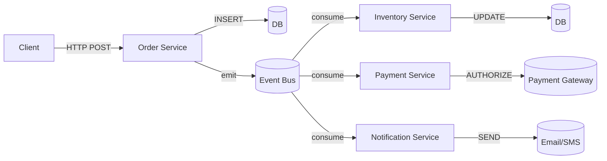
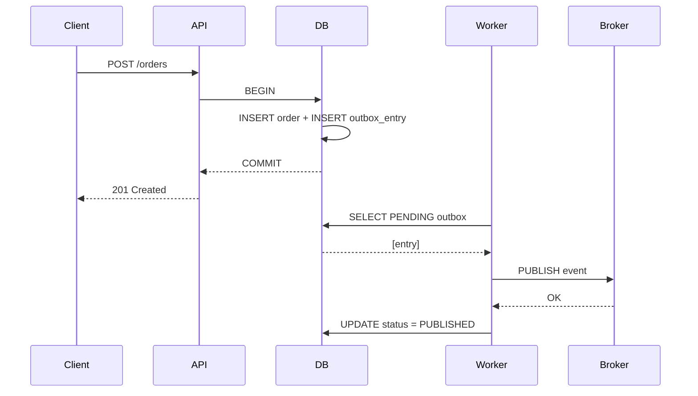
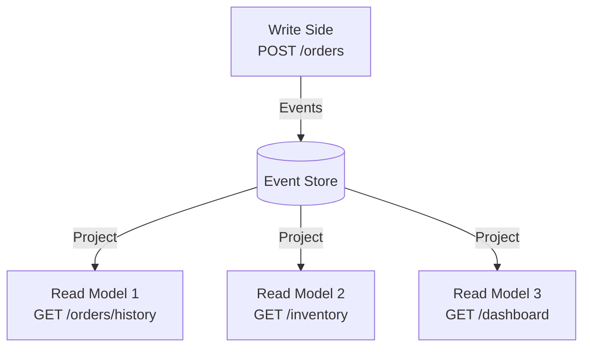
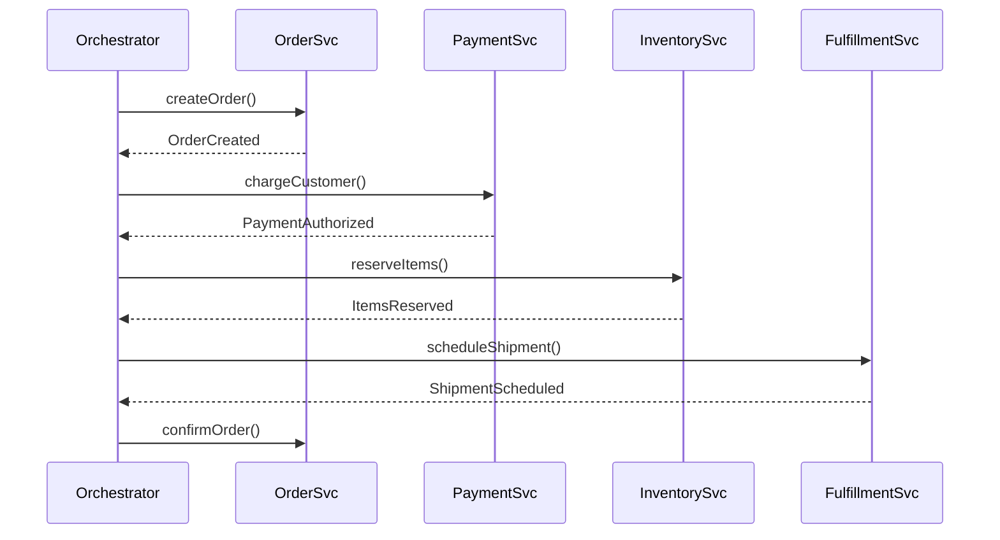

## The Problem with Synchronous Calls

In a monolith, a single HTTP call can chain through multiple modules in one transaction. Move to microservices and that chain becomes a distributed graph of synchronous calls — brittle, tightly coupled, and impossible to scale independently.

The alternative: **decouple via events**.

Each service owns its data and reacts to events. No service calls another directly — they all listen to the bus.

## The Outbox Pattern: Guaranteeing At-Least-Once Delivery

The hard problem: a database write and an event publish can't be atomic across process boundaries. If the HTTP call to the broker fails after the DB commit, you're in an inconsistent state.

The key insight: the DB write and the outbox write are in the **same transaction**. Either both succeed or neither does. The worker polls the outbox table and retries until the broker acknowledges.

## CQRS: Separating Reads from Writes

Command Query Responsibility Segregation solves the read/write conflict in event-driven systems. Your write model is optimized for transactions. Your read model is optimized for queries.

Event sourcing takes this further: instead of storing current state, you store the sequence of events that produced it. The current state is a replay.

## Saga Pattern: Managing Distributed Transactions

ACID transactions don't span services. When a business operation requires multiple services to participate, you need a coordination strategy.

If any step fails, the orchestrator issues compensating transactions to rollback: refund the payment, release the inventory reservation, cancel the shipment.

## Choosing Your Broker

| Broker | Durability | Replay | Ordering | Best For |
|--------|-----------|--------|----------|---------|
| **Kafka** | Persistent | From offset | Per partition | High-throughput, replay-heavy workloads |
| **RabbitMQ** | Optional | No | Per queue | Task queues, fan-out patterns |
| **Redis Pub/Sub** | Fire-and-forget | No | Per channel | MVP, low-latency, local dev |
| **SQS** | Persistent | Via visibility timeout | Best-effort | AWS-native, serverless |

For a financial system processing millions of transactions daily, **Kafka** is the clear choice. For a quick prototype or local development, **Redis Pub/Sub** gets you running in minutes.

## Conclusion

Event-driven architecture trades the simplicity of ACID transactions for the scalability of eventual consistency. The patterns exist to manage that tradeoff:

- **Outbox Pattern** for reliable event publication
- **Saga Pattern** for distributed transaction coordination
- **CQRS** for separating read and write concerns
- **Event Sourcing** for auditability and replay

The complexity is real, but so is the gain: services that scale independently, systems that survive partial failures, and architectures that evolve with the business.
