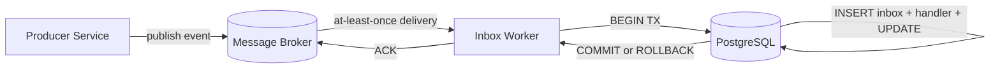
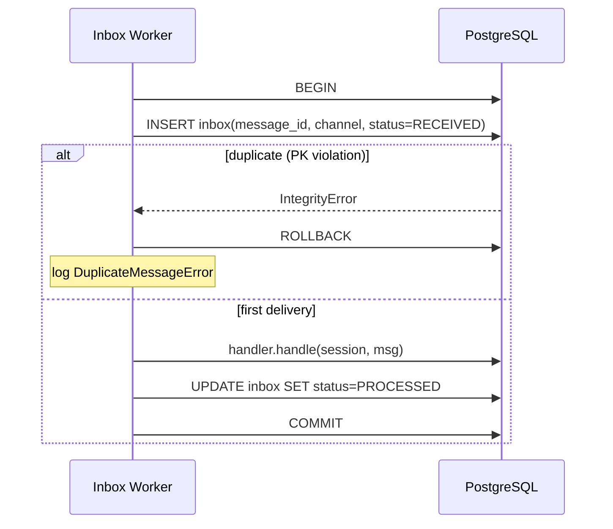
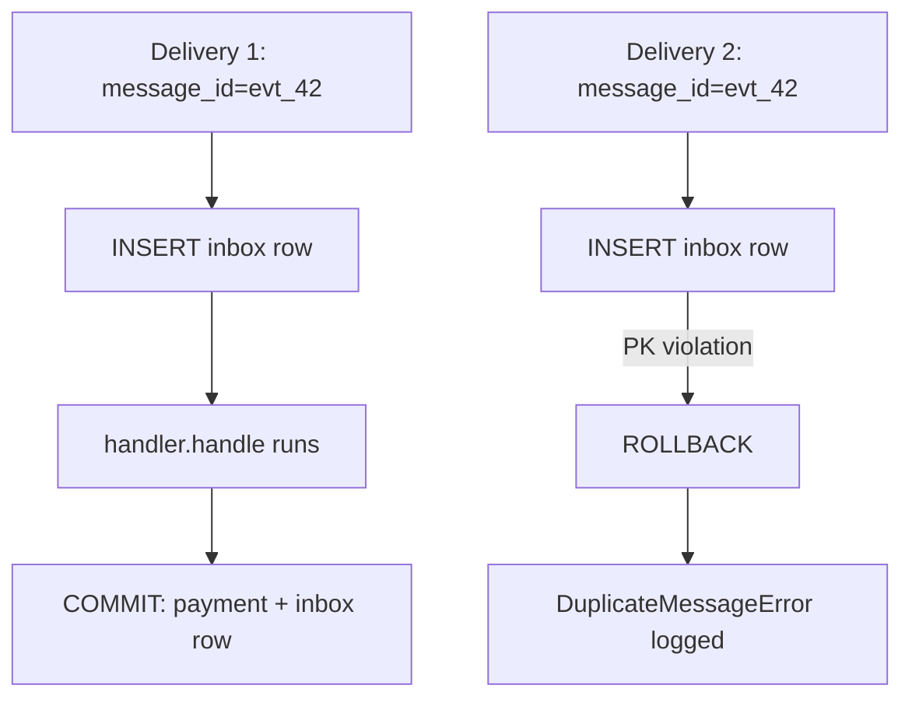

# Your Broker Lies About Delivery — Here's How to Process Every Message Exactly Once

*A primary-key constraint delivers true exactly-once processing from any at-least-once broker.*

## Abstract

Every message broker promises at-least-once delivery. Some also promise exactly-once semantics, but those promises come with asterisks — Kafka's exactly-once requires transaction coordinators and idempotent producers; Redis Pub/Sub doesn't even try. The Inbox Pattern delivers genuine exactly-once processing at the consumer level using a mechanism so simple it feels like cheating: a primary key constraint. This paper presents the Inbox Pattern as implemented in a Python-based banking transaction system, with the specific design choices that make exactly-once processing reliable in production.

**Index Terms** — inbox pattern, exactly-once processing, at-least-once delivery, deduplication, primary key constraint, PostgreSQL, message broker, idempotent consumer.

---

## 1. Introduction

Brokers guarantee at-least-once delivery. This means any message may be delivered more than once. Network retransmissions, consumer rebalances, broker failovers — all can cause duplicate deliveries. If a consumer applies a business effect on every delivery, duplicates produce incorrect state: duplicate orders, double charges, duplicate notifications.

The traditional approach is to make the consumer idempotent — designed so that applying the same operation multiple times produces the same result as applying it once. But full idempotency is notoriously difficult to achieve. A payment service must maintain a ledger of processed transaction IDs. An order service must check for existing orders before creating new ones. The idempotency logic invades the business layer.

The Inbox Pattern takes a different approach: it pushes the deduplication concern to the storage layer. Before any business logic runs, the consumer inserts a row with `message_id` as the primary key. If the message is a duplicate, the insert collides on the primary key, the database rejects it, and the business logic never executes. The deduplication is automatic, race-free, and requires no application-level idempotency.

The contributions of this paper are:

1. A formalization of the Inbox Pattern as the consumer-side complement to the Transactional Outbox pattern, providing exactly-once processing from any at-least-once broker.
2. The primary-key-based deduplication mechanism, with correctness arguments for atomicity, concurrency safety, and exactly-once processing.
3. A typed failure semantics model that distinguishes transient from permanent handler failures.
4. Operational guidance on when the pattern is and is not appropriate.

## 2. Background

At-least-once delivery is the norm in distributed messaging. Apache Kafka delivers messages at least once by default; exactly-once semantics require enabling idempotent producers and transactional consumers, which carries performance and operational overhead [1]. Redis Pub/Sub makes no delivery guarantees — subscribers may miss messages during disconnections and receive duplicates on reconnection [2]. RabbitMQ with consumer acknowledgments can redeliver unacknowledged messages after a consumer crash. The *Network is Reliable* fallacy formalized by Bailis et al. [10] shows that any networked communication is subject to loss, duplication, and reordering.

The Idempotent Consumer pattern, catalogued by Richardson [3], addresses this by requiring the consumer to recognize and discard duplicates. The classical implementation checks a "processed message IDs" store before applying business logic. This check-and-act pattern, however, is vulnerable to a timing window when two deliveries race: both may pass the check before either has written. Kleppmann [4] devotes an entire chapter of *Designing Data-Intensive Applications* to the subtleties of duplicate detection in distributed systems. The Inbox Pattern eliminates the check-then-act window by delegating deduplication to the database's primary key constraint.

## 3. System Overview

The Inbox Pattern sits between the message broker and the business handler. The worker subscribes to a broker channel, parses each delivery into a `ReceivedMessage`, and opens a single database transaction that contains the dedup insert, the handler execution, and the status update. The database is the source of truth for "what has been processed," and the broker is reduced to a delivery mechanism.



| Component | Responsibility |
|-----------|----------------|
| `inbox` table | One row per `message_id`; primary key enforces deduplication |
| Atomic transaction | Wraps the dedup insert, the business handler, and the status update |
| Inbox worker | Subscribes to the broker, parses each delivery, runs the transaction |
| Message handler | Performs business writes through the same session as the dedup insert |
| Message broker | At-least-once delivery transport (Kafka, RabbitMQ, Redis Pub/Sub, …) |

## 4. Implementation Details

The implementation centers on a single function — `process_message` — that owns the atomicity invariant. Everything else (handler dispatch, failure semantics, observability) hangs off this invariant. The choice to use the primary key (not a unique index, not an application-level check) is deliberate: the primary key constraint is the most fundamental integrity guarantee in PostgreSQL, checked on every insert, enforced at the storage level, and serialized correctly under concurrent access [9].

### 4.1 The Atomic Processing Transaction

```python
def process_message(session, msg, handler):
    # Step 1: insert dedup row (raises DuplicateMessageError if duplicate)
    entry = InboxEntry(message_id=msg.event_id, ...)
    session.add(entry)
    try:
        session.flush()
    except IntegrityError:
        session.rollback()
        raise DuplicateMessageError(msg.event_id)

    # Step 2: execute business logic in same transaction
    handler.handle(session, msg)

    # Step 3: mark processed
    entry.status = PROCESSED
    entry.processed_at = datetime.now(timezone.utc)
    session.flush()
```

The sequence of operations inside a single database transaction is the heart of the pattern. PostgreSQL evaluates the primary key constraint at flush time, raising `IntegrityError` if the row collides. On `IntegrityError`, the entire transaction rolls back — there is no partial business effect.

### 4.2 Handler Dispatch Protocol

Messages are routed to handlers through a two-part dispatch key: `(aggregate_type, event_type)`. This design choice prevents cross-wire dispatch errors when two aggregate types share an event type name. ADR-007 in the reference repository [6] documents the rationale.



```python
class MessageHandler(Protocol):
    aggregate_type: str
    event_type: str
    key: str

    def handle(self, session: Session, message: ReceivedMessage) -> None: ...

class SagaStepFromTxnCreated:
    aggregate_type = "Transaction"
    event_type = "TransactionCreated"
    key = "Transaction.TransactionCreated"

    def handle(self, session, message):
        data = json.loads(message.raw_payload).get("data", {})
        step = SagaStep(
            transaction_id=message.aggregate_id,
            decision="approved",
            inbox_message_id=message.event_id,
        )
        session.add(step)
```

The handler is stateless and performs only database writes through the provided session. It does not call the broker. This guarantees the handler's side effects stay inside the same database transaction as the dedup insert — the fundamental invariant of the pattern.

### 4.3 Typed Failure Semantics

Handlers signal failure intent through typed exceptions:

| Exception | Meaning | Behavior |
|-----------|---------|----------|
| `TransientHandlerError` | Retryable failure (network blip, resource contention) | Transaction rolls back, inbox row not persisted, entry retried with backoff |
| `FinalHandlerError` | Permanent failure (invalid data, violated business rule) | Transaction rolls back, inbox row set to `FAILED`, manual retry required |
| Unexpected exceptions | Unknown failure | Treated as transient by default, retried with backoff |

Poison messages — malformed payloads that cannot be parsed — are handled before the inbox insert occurs. The worker parses the raw bytes into a `ReceivedMessage` dataclass, validating required fields. If parsing fails, the message is dropped, logged, and counted separately via a Prometheus counter. No inbox row is created.

## 5. Correctness Arguments

**Property**: Every message delivered to the worker produces at most one committed business effect, even under concurrent duplicate deliveries.

**Why it holds**: Three correctness properties follow from the design.

**Atomicity.** The inbox insert, the business handler execution, and the status update share one database transaction. If any step fails, everything rolls back. There is no window where the business effect exists without the dedup row, or the dedup row exists without the business effect.

**Concurrency safety.** If two worker threads receive the same `message_id` concurrently, PostgreSQL serializes the two insert attempts. The first succeeds. The second receives `IntegrityError`. The losing transaction rolls back entirely — no partial business effect. There is no check-then-act race because the constraint is enforced at the storage level, not in application code.

**Exactly-once processing.** Each `message_id` produces at most one committed business effect. Duplicate deliveries produce a rollback and a logged `DuplicateMessageError`. The business logic is never re-executed.



The diagram above shows the two-delivery case: the first transaction commits both the dedup row and the business effect; the second collides on the primary key and rolls back entirely. The business logic on the second delivery is never executed.

**Limits of the guarantee.** The guarantee holds only when all business side effects are within the same database transaction as the dedup insert. If the handler calls an external API, sends an email, or writes to a file, the rollback can no longer undo the side effect.

## 6. Discussion

### 6.1 Benefits

**Exactly-once processing without application idempotency.** Handlers are written as straightforward business logic. They insert, update, and delete without checking whether the message is a duplicate. The deduplication is entirely at the storage layer.

**Race-free concurrency.** Multiple worker threads can process the same message channel concurrently. The database serializes primary key insertions. There is no need for distributed locks, leader election, or advisory locks. PostgreSQL handles the concurrency control.

**No broker dependency for deduplication.** The pattern works with any broker that provides at-least-once delivery. It does not require Kafka's transaction API, support for consumer group offsets, or any broker-specific deduplication feature. This makes it applicable across Redis Pub/Sub, RabbitMQ, Kafka, NATS, and SQS.

**Auditability.** The inbox table is a complete record of every message received and whether it was processed, failed, or deduplicated. Operators can query, filter, and inspect the inbox table using standard SQL. Failed messages are candidates for manual retry.

**Observability.** Standard metrics — messages received, processed, failed, duplicated — are available through database queries and Prometheus counters. The inbox table provides holistic visibility into message processing health.

### 6.2 Operational Tradeoffs and Limitations

**Latency cost of a database write per message.** Each message requires at least one round trip to the database before the business logic runs. Throughput-bound systems (millions of messages per second with microsecond-level latency requirements) find this too expensive.

**Storage growth.** Every message creates a persistent row in the inbox table. Production deployments need a retention policy — `DELETE` or partition drop after N days — or archival to cold storage. Without one, the table grows without bound.

**Database coupling.** The pattern depends entirely on the database's primary key constraint and serializable-or-stronger isolation. NoSQL stores with relaxed consistency guarantees do not provide the same guarantee. The database is the correctness boundary.

## 7. Related Work

**Kafka exactly-once semantics.** Kafka with `isolation.level=read_committed` and idempotent producers provides end-to-end exactly-once semantics within the Kafka ecosystem [1]. If the entire pipeline uses Kafka and there is no need to interoperate with other systems, Kafka's native exactly-once is simpler. The Inbox Pattern is the right choice when the pipeline crosses broker boundaries or when the broker does not offer exactly-once.

**In-memory deduplication.** A bounded cache (e.g., a Bloom filter or Redis-backed dedup set) can short-circuit duplicate detection without a database round-trip. This trades the correctness guarantee for throughput: cache eviction reintroduces the duplicate problem silently.

**Idempotent consumer pattern.** Richardson [3] describes the application-level check-and-act approach. The Inbox Pattern is the storage-level realization of the same idea — but with the race window closed by the primary key constraint instead of an application-level lock.

## 8. Conclusion

The Inbox Pattern reduces exactly-once message processing to a primary key constraint. By pushing deduplication into the database, it eliminates the check-then-act race window that plagues application-level idempotency. The atomicity invariant — one database transaction containing the dedup insert, the handler, and the status update — is the entire mechanism. The pattern composes with the Transactional Outbox pattern to deliver end-to-end exactly-once semantics on top of at-least-once brokers, without distributed transaction coordinators. Its cost is one extra database round-trip per message; its benefit is a correctness guarantee that survives concurrent duplicates, worker crashes, and broker failovers.

---

## References

[1] J. Kreps, N. Narkhede, and J. Rao, "Kafka: A Distributed Messaging System for Log Processing," in *Proc. 6th Int. Workshop Networking Meets Databases (NetDB)*, 2011.

[2] Redis Ltd., "Redis Pub/Sub Documentation," 2023. [Online]. Available: <https://redis.io/docs/latest/develop/interact/pubsub/>

[3] C. Richardson, "Pattern: Idempotent Consumer," microservices.io, 2021.

[4] M. Kleppmann, *Designing Data-Intensive Applications*. O'Reilly Media, 2017, ch. 11, pp. 509–514.

[5] Inbox Pattern Repository, "ADR-005: message_id as Primary Key of the inbox Table," 2026.

[6] Inbox Pattern Repository, "ADR-007: Dispatch by (aggregate_type, event_type), not by channel," 2026.

[7] Inbox Pattern Repository, "Inbox repository — pure DB operations," `/inbox_pattern/inbox_app/inbox/repository.py`, 2026.

[8] Inbox Pattern Repository, "Inbox service — process_message with atomicity invariant," `/inbox_pattern/inbox_app/inbox/service.py`, 2026.

[9] PostgreSQL Global Development Group, *PostgreSQL 16 Documentation*, 2023. [Online]. Available: <https://www.postgresql.org/docs/16/>

[10] P. Bailis et al., "The Network is Reliable," *Commun. ACM*, vol. 60, no. 1, pp. 62–69, 2017.

---

*Manuscript received June 30, 2026; revised June 30, 2026.*
