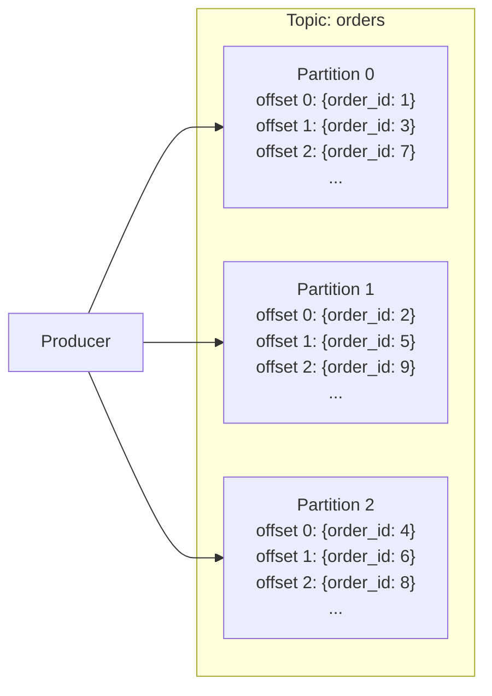
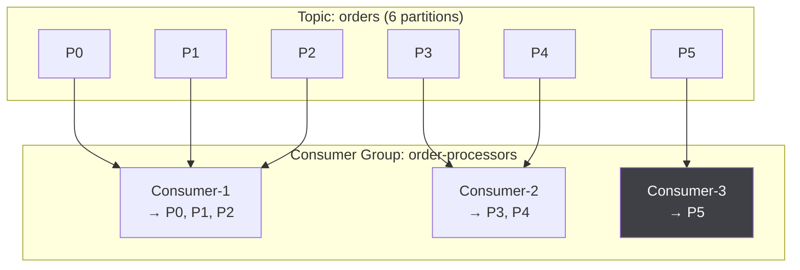
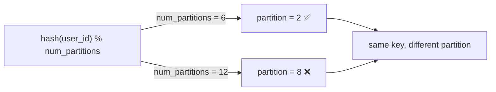
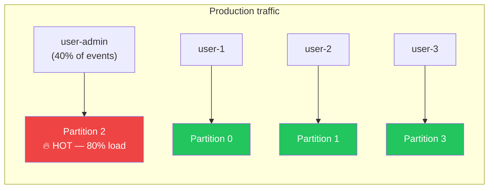
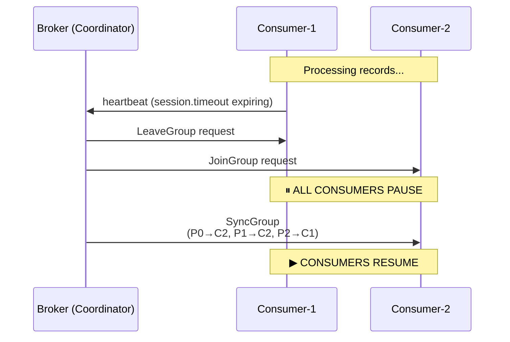
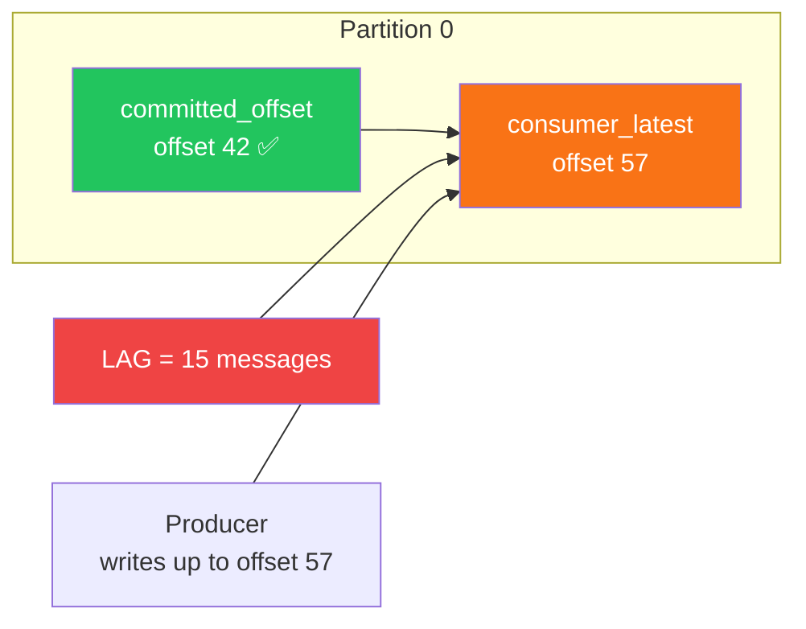
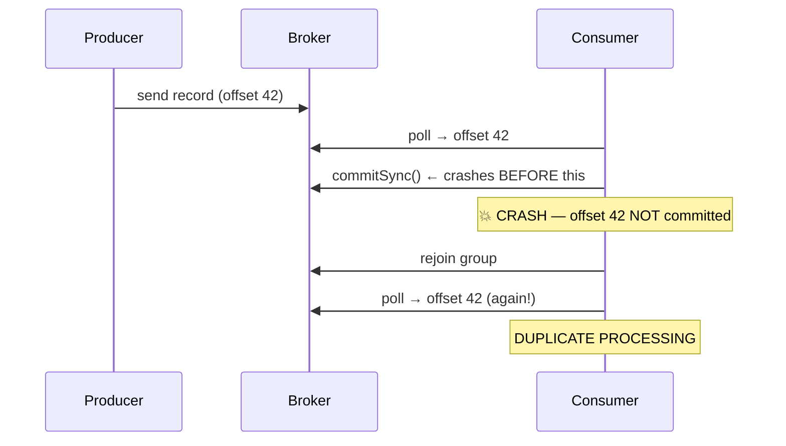
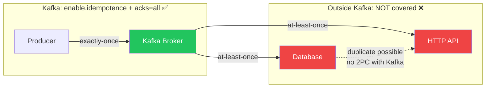

# Kafka Partitions, Consumer Groups, and the Failure Modes You Will Actually Hit

Most Kafka tutorials explain partitions and consumer groups correctly. What they omit is the behavior at the edges: what happens when a consumer dies mid-partition, why increasing partitions breaks existing keyed messages, why your consumer lag grows silently under load, and why `at-least-once` delivery is harder than it sounds. This paper covers the mechanics you need to reason about production systems, not the happy path.

**Index Terms** — Kafka partition, consumer group, offset commit, producer acks, consumer lag, partition rebalance, Kafka configuration

---

## 1. Introduction

Kafka's model is deceptively simple: producers write records to topics, consumers read from topics, and partitions are the unit of parallelism. The simplicity is in the model; the complexity is in the operational behavior that emerges from that model under failure, rebalance, and load.

Teams adopting Kafka for event-driven architectures routinely encounter the same set of problems in production: consumer lag growing unboundedly, partition rebalances that pause consumption for seconds, duplicate messages after a consumer crash, and throughput ceiling caused by hot partitions. These are not bugs in Kafka — they are consequences of configuration decisions made early in the design phase, when the system was small and the constraints were invisible.

This paper's contributions:

1. A precise model of partition assignment, consumer group membership, and offset commit semantics
2. A taxonomy of failure modes organized by root cause
3. Configuration guidance with explicit thresholds and the reasoning behind them
4. Partition strategy heuristics for common access patterns

## 2. Background

### 2.1 The Kafka Log

A Kafka topic is a partitioned, append-only log. Each partition is an ordered sequence of records identified by a monotonically increasing offset. Offsets are local to a partition — offset `42` in partition `0` refers to a different record than offset `42` in partition `1`.



Producers assign a partition by key (default: `hash(key) % num_partitions`) or round-robin when no key is provided. The offset of a written record is the responsibility of the broker; producers never choose an offset.

### 2.2 Consumer Groups

A consumer group is a set of consumers cooperating to read a topic. Kafka assigns partitions to group members such that each partition is assigned to exactly one consumer in the group. If there are more partitions than consumers, some consumers own multiple partitions. If there are more consumers than partitions, some consumers own zero partitions and are effectively idle.



Rebalancing is the process by which Kafka reassigns partitions when a consumer joins, leaves, or dies. During a rebalance, all consumption in the group pauses. The duration of this pause is a function of the `session.timeout.ms` and `heartbeat.interval.ms` settings — not instantaneous.

## 3. Producer Configuration

### 3.1 Acknowledgment Levels

The `acks` producer configuration determines how many broker replicas must acknowledge a write before the producer considers it committed:

| `acks` | Durability | Latency | Use case |
|---|---|---|---|
| `0` | None — fire and forget | Lowest | Metrics collection, logging where loss is acceptable |
| `1` | Leader only | Medium | Most production use cases |
| `all` / `-1` | Leader + all in-sync replicas | Highest | Financial systems, orders, anything with zero tolerance for loss |

```java
// Producer configuration — durability vs latency tradeoff
Properties props = new Properties();
props.put("bootstrap.servers", "kafka-1:9092,kafka-2:9092,kafka-3:9092");
props.put("key.serializer", "org.apache.kafka.common.serialization.StringSerializer");
props.put("value.serializer", "org.apache.kafka.common.serialization.StringSerializer");

// Default acks=1. Set to "all" for exactly-once semantics at the broker level
props.put("acks", "all");

// Retries: Kafka retries automatically, but this caps the attempt count
props.put("retries", Integer.MAX_VALUE);
props.put("retry.backoff.ms", 100);
```

### 3.2 Idempotent Producers

Without idempotency, a network retry can produce duplicate messages — the broker receives the write, the acknowledgment is lost, the producer retries, and the message appears twice. Enabling idempotent producers eliminates this:

```java
props.put("enable.idempotence", true);
```

When `enable.idempotence` is `true`, Kafka assigns a producer ID (`pid`) and a sequence number to each message. The broker deduplicates retries using this tuple. This adds a small overhead (~3-5% in most benchmarks) and is the correct default for any system where duplicate messages have business cost.

### 3.3 The Keyed Message Problem

If your producer uses message keys for partitioning (e.g., `user_id` as the key to co-locate all events for a single user), changing the partition count breaks the key-to-partition mapping:



This is why Kafka operators treat partition count as a production-critical configuration: it cannot be changed without reassigning all existing messages or accepting that keyed messages for the same key will land on different partitions after the change.

## 4. Partition Strategy

### 4.1 Rule of Thumb: Partition Count = Peak Throughput / Consumer Throughput

Each partition is consumed by exactly one consumer in a group. If your consumer processes 1,000 messages/second and you need to consume 10,000 messages/second at peak, you need at least 10 partitions. This calculation should use **peak throughput**, not average — a system that averages 5,000 msg/s but peaks at 20,000 needs 20 partitions, not 5.

### 4.2 The Hot Partition Problem

When using key-based partitioning, a skewed key distribution produces hot partitions. User IDs, tenant IDs, or geographic region as keys all exhibit this failure mode if distribution is not uniform:



Mitigation strategies:

1. **Append a random suffix to the key** when the business constraint of key co-location is not critical:
   ```java
   String key = userId + "-" + ThreadLocalRandom.current().nextInt(0, 10);
   producer.send("events", key, event);
   ```
   Tradeoff: messages for the same logical entity are no longer ordered across partitions.

2. **Use a composite key** with a high-cardinality field:
   ```java
   // Instead of: key = "tenant-1"
   // Use: key = "tenant-1-session-abc123"
   ```

3. **Partition by namespace + random bucket** — hash the concatenation of the logical key and a small random integer, then modulo by a large partition count. This keeps messages roughly uniform while maintaining approximate ordering per logical key within each sub-partition.

### 4.3 Partition Count and Replication

Replication factor is independent of partition count. A topic with 6 partitions and replication factor 3 has 18 partition replicas (6 × 3) distributed across brokers. The leader broker for each partition handles all reads and writes; followers replicate asynchronously.

For a 3-broker cluster, a replication factor of 3 means every partition has all replicas on all brokers — maximum durability but highest resource cost. A replication factor of 2 means each partition's replica is on one other broker — still durable for a single-broker failure, but a second concurrent failure loses data.

```yaml
# Topic configuration
Topic: orders
Partitions: 12
Replication factor: 3  # minimum for production: 3
```

## 5. Consumer Group Mechanics

### 5.1 Offset Management

Kafka tracks the consumer's read position per partition using an internal topic called `__consumer_offsets`. When a consumer calls `.commit()` (or the auto-commit interval fires), the current offset of each assigned partition is recorded.

Two commit policies:

**Auto-commit** (`enable.auto.commit=true`, interval `auto.commit.interval.ms`):
```java
// Commits every 5 seconds regardless of whether the consumer finished processing
props.put("enable.auto.commit", true);
props.put("auto.commit.interval.ms", 5000);
```
Risk: if the consumer crashes between the last auto-commit and the last successfully processed message, that message is reprocessed. Acceptable when message deduplication is handled downstream (e.g., by idempotent consumers).

**Manual commit** (`enable.auto.commit=false`):
```java
while (true) {
    ConsumerRecords<String, byte[]> records = consumer.poll(Duration.ofMillis(500));
    for (ConsumerRecord<String, byte[]> record : records) {
        process(record);
    }
    // Commit only after all records in this batch are successfully processed
    consumer.commitSync();
}
```
This is the correct choice when at-least-once delivery must be guaranteed by the consumer: commit the offset only after the record is fully processed.

### 5.2 Rebalance Protocol

When a consumer joins or leaves a group, Kafka triggers a rebalance: all consumers stop, partitions are reassigned, and consumption resumes:



The duration of this pause depends on:

- `session.timeout.ms` — how long a broker waits before declaring a consumer dead (default: 10s)
- `heartbeat.interval.ms` — how often the consumer sends a heartbeat (default: 3s)
- `max.poll.interval.ms` — how long a consumer can go without calling `.poll()` before being considered dead (default: 5min)

```java
// Aggressive settings for low-latency workloads
props.put("session.timeout.ms", 10000);      // declare dead after 10s without heartbeat
props.put("heartbeat.interval.ms", 3000);    // heartbeat every 3s
props.put("max.poll.interval.ms", 300000);   // 5 minutes max between polls

// Conservative settings for long-running processing (e.g., DB writes per record)
props.put("session.timeout.ms", 30000);
props.put("heartbeat.interval.ms", 10000);
props.put("max.poll.interval.ms", 600000);   // 10 minutes
```

The `max.poll.interval.ms` setting is frequently misconfigured. If your processing per record involves an HTTP call, a database write, or any I/O-bound operation, 5 minutes may not be enough. A consumer that exceeds `max.poll.interval.ms` between polls is ejected from the group, triggering another rebalance — a death spiral if the processing time genuinely exceeds the threshold.

### 5.3 Sticky Partition Assignment

The default partition assignment strategy (`RangeAssignor`) assigns whole topics to consumers, which can produce an imbalance when partition counts are not evenly divisible by consumer counts. `StickyAssignor` was introduced to minimize the partition movement during rebalances:

```java
props.put("partition.assignment.strategy", "org.apache.kafka.clients.consumer.StickyAssignor");
```

More importantly, `StickyAssignor` preserves the existing assignment as much as possible when a consumer leaves — minimizing the amount of state that must be discarded and reprocessed.

## 6. Consumer Lag

### 6.1 Definition

Consumer lag is the difference between the latest offset written to a partition and the latest offset committed by a consumer. It is the primary operational metric for a Kafka consumer and the single clearest signal of whether a consumer is keeping up with producers.



```
lag = consumer.latest_offset - consumer.committed_offset
```

A lag of 0 means the consumer has processed every message. A growing lag means the consumer is falling behind. A lagging consumer under load will eventually exhaust the broker's retention window if lag grows beyond `retention.ms` — at which point messages are deleted before they are consumed.

### 6.2 Common Causes of Lag Growth

**Cause 1: Consumer poll batch too large**
```java
// BAD: processes one record at a time, synchronous I/O per record
while (true) {
    ConsumerRecords<String, byte[]> records = consumer.poll(Duration.ofMillis(500));
    for (ConsumerRecord<String, byte[]> record : records) {
        processSync(record); // 50ms per record → 20 records/second max
    }
}
```

**Cause 2: Slow downstream dependency**
If the consumer writes to a database, the throughput ceiling is the database's write throughput, not Kafka's. Adding partitions does not help if the bottleneck is the database.

**Cause 3: GC pauses**
JVM garbage collection pauses can exceed `session.timeout.ms`, causing the consumer to be ejected from the group mid-processing. Monitor GC logs alongside consumer lag.

**Cause 4: Skewed partitions**
If one partition receives 5× the traffic of others, a single consumer thread processing that partition will lag while others are idle.

### 6.3 Lag Monitoring

```bash
# Check lag for a specific consumer group
kafka-consumer-groups.sh --bootstrap-server kafka:9092 \
  --group order-processor \
  --describe

# Output:
# GROUP           TOPIC  PARTITION  CURRENT-OFFSET  LOG-END-OFFSET  LAG
# order-processor orders  0          1042            1204            162
# order-processor orders  1          987             987             0
# order-processor orders  2          1103            1121            18
```

In production, export consumer lag to Prometheus via JMX Exporter or use a managed service's lag monitoring (Confluent Control Center, AWS MSK monitoring). A lag threshold alert should fire at 1,000 messages and escalate at 10,000.

## 7. Common Failure Modes

### 7.1 Duplicate Messages After Consumer Crash

**Scenario**: Consumer processes a record, crashes before committing offset, restarts, re-processes the same record.



**Root cause**: At-least-once delivery without idempotent consumers or downstream deduplication.

**Fix**: Make message processing idempotent at the consumer level, or deduplicate at the application level using a unique message ID:

```java
// Idempotent processing using a Redis set
String messageId = record.key() + "-" + record.offset();
if (redis.setnx("processed:" + messageId, "1")) {
    // Key did not exist — first time seeing this message
    process(record);
} else {
    // Already processed — skip
}
```

### 7.2 Requeue Storm After a Consumer Failure

**Scenario**: A consumer dies. The broker waits `session.timeout.ms` before declaring it dead and triggering a rebalance. During the rebalance, all other consumers stop. Messages continue being produced. When the group stabilizes, the new consumer starts from the last committed offset — missing all messages produced during the rebalance window.

**Root cause**: `session.timeout.ms` too low relative to normal processing time, or `heartbeat.interval.ms` too high relative to the broker's willingness to wait.

**Fix**: `session.timeout.ms` should be at least 3× the maximum expected time between heartbeats. With `heartbeat.interval.ms=3000`, `session.timeout.ms` should be at least `9000`.

### 7.3 Partition Skew from Zipfian Key Distribution

**Scenario**: A topic keyed by tenant ID has 10 partitions. One tenant (`tenant-alpha`) represents 40% of traffic because it is the largest customer. `tenant-alpha`'s events all go to partition 2. One consumer thread processes partition 2 and falls behind while the other 9 threads are idle.

**Fix**: Use a composite key (`tenant-id + product-category`) or append a random suffix when per-key ordering is not a hard requirement.

### 7.4 Retention Window Loss

**Scenario**: Consumer lag grows beyond the topic's `retention.ms`. Messages are deleted from the log before the consumer processes them. The consumer resumes from the last committed offset and misses the deleted messages.

**Root cause**: Retention configured too low relative to the worst-case consumer lag.

**Fix**: Calculate the maximum tolerable lag: `max_lag_time = max_consumer_lag_messages / peak_produce_rate`. Set `retention.ms` to at least `max_lag_time * 2`.

### 7.5 Exactly-Once Semantics Misunderstanding

**Scenario**: Developer configures `acks=all` and idempotent producers, then assumes exactly-once delivery end-to-end. Writes to an external system (database, HTTP endpoint) are still at-least-once or at-most-once depending on the integration.



**Root cause**: Kafka's exactly-once guarantee (`enable.idempotence=true` + `acks=all`) applies only to Kafka-to-Kafka delivery. Any external system integration requires its own exactly-once protocol (e.g., the transactional outbox pattern, two-phase commit, or idempotent writes).

## 8. Configuration Reference

### 8.1 Producer

| Parameter | Recommended | Rationale |
|---|---|---|
| `acks` | `all` | Zero data loss in production |
| `enable.idempotence` | `true` | Eliminates broker-side duplicates on retry |
| `retries` | `Integer.MAX_VALUE` | Automatic retry for transient failures |
| `retry.backoff.ms` | `100` | Backoff between retry attempts |
| `max.in.flight.requests.per.connection` | `5` | With idempotence: 5. Without: 1 (else reordered on retry) |
| `compression.type` | `lz4` or `zstd` | Lower network and storage cost; lz4 is fastest |

### 8.2 Consumer

| Parameter | Recommended | Rationale |
|---|---|---|
| `enable.auto.commit` | `false` | Manual commit after successful processing |
| `auto.offset.reset` | `earliest` | For replaying from the beginning; `latest` for live-only |
| `session.timeout.ms` | `10000` | 10s default; increase for slow processing |
| `heartbeat.interval.ms` | `session.timeout.ms / 3` | Keepalive ratio |
| `max.poll.records` | `500` | Cap per-poll batch; tune to processing time |
| `max.poll.interval.ms` | `300000` | Increase for slow consumers; must exceed processing time |
| `fetch.min.bytes` | `1` | Default 1; increase to batch larger fetches at latency cost |
| `fetch.max.wait.ms` | `500` | Maximum wait for `fetch.min.bytes` to be satisfied |

## 9. Conclusion

Kafka's partition/consumer group model is the right primitive for ordered, parallel, fault-tolerant stream processing — but it makes explicit the tradeoffs that other messaging systems hide. Partition count constrains parallelism and cannot be changed without reassignment. Consumer lag is a real-time indicator of system health that must be monitored. Consumer group rebalances are brief but costly under load. Exactly-once delivery is achievable only within Kafka's boundary; anything outside requires its own idempotency strategy.

The operational discipline that keeps Kafka pipelines healthy is straightforward: monitor lag continuously, configure `session.timeout.ms` with headroom for slow processing, size partition count for peak throughput not average, prefer manual offset commits for at-least-once guarantees, and treat the external system integration as a separate exactly-once problem with its own solution.

---

## References

[1] Confluent, "Apache Kafka Internals," Confluent Documentation, 2025. [Online]. Available: https://docs.confluent.io/platform/current/kafka/internals.html

[2] J. Kreps, "I Love My Kay: Why Kafka Is So Fast," Confluent Blog, 2017. [Online]. Available: https://www.confluent.io/blog/apache-kafka-fast-messages/

[3] G. Franklin et al., "Kafka: A Distributed Messaging System for Log Processing," Proc. NetDB, 2011.

[4] Confluent, "Consumer Group Offsets," Confluent Platform Documentation, 2025. [Online]. Available: https://docs.confluent.io/platform/current/kafka/post-deployment.html#consumer-offset-management

[5] AWS, "Amazon MSK Developer Guide — Monitoring Consumer Lag," 2025. [Online]. Available: https://docs.aws.amazon.com/msk/latest/developerguide/monitoring.html

[6] G. Toderici, "Exactly-Once Semantics in Kafka and Spring," Confluent Blog, 2022. [Online]. Available: https://www.confluent.io/blog/exactly-once-semantics-in-apache-kafka/

---

*Manuscript received June 29, 2026.*
