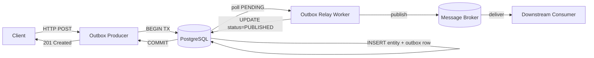
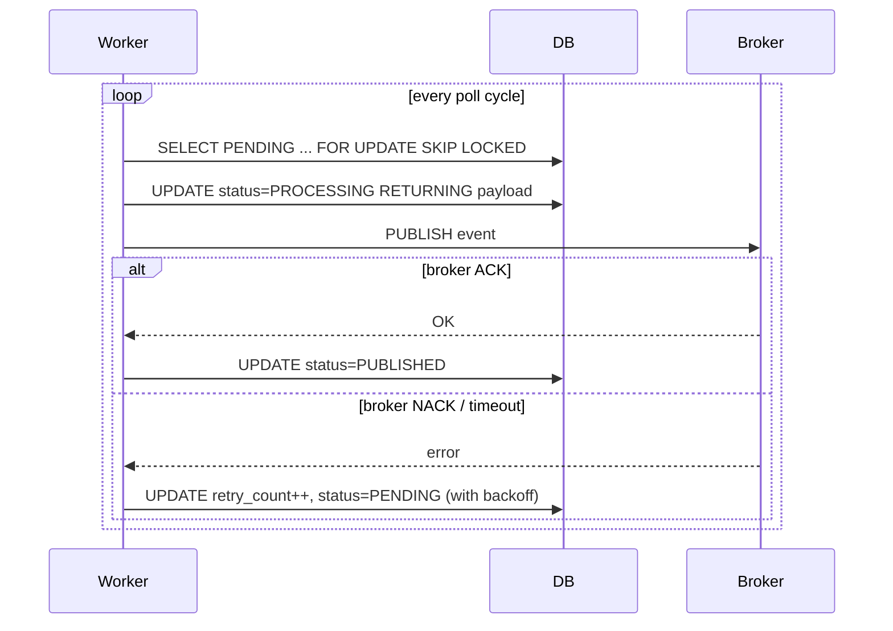
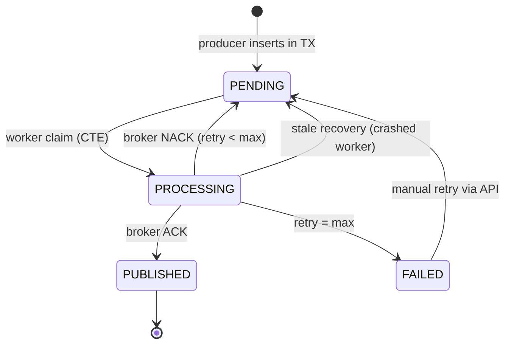
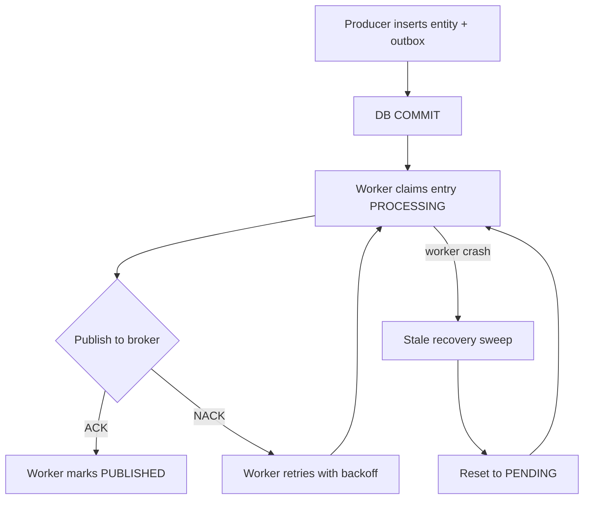

# Stop Using 2PC: One Database Table Guarantees Your Events Always Get Published

*A database transaction and a background worker replace the distributed coordinator.*

## Abstract

The dual-write problem is the bane of every event-driven system. You write to the database, publish to the broker — and then a crash happens between them. The Transactional Outbox pattern solves this with shocking simplicity: both writes happen in the same database transaction, and a background worker handles the rest. No distributed coordinator, no two-phase commit, no magic. This paper presents the Transactional Outbox pattern as implemented in a Python-based banking transaction system, with the specific algorithms and design choices that make it work in production.

**Index Terms** — transactional outbox, dual-write problem, at-least-once delivery, PostgreSQL, FOR UPDATE SKIP LOCKED, change data capture, message broker, microservices.

---

## 1. Introduction

When a microservice needs to write to its database and publish a message to a broker, a crash between the two operations produces an inconsistency. A committed transaction with no published event leaves downstream systems blind. A published event with no committed transaction leaves downstream systems acting on data that does not exist. This is the dual-write problem, and every distributed system builder has encountered it.

The Transactional Outbox pattern solves this at the storage layer. Instead of attempting an atomic write across two independent systems — which is impossible without a distributed coordinator — the pattern writes both the business entity and the event record in a single database transaction. A background worker polls the outbox table and publishes events to the broker, retrying until the broker acknowledges. The database transaction provides the atomicity guarantee that the broker cannot.

The contributions of this paper are:

1. A concrete algorithm for the Transactional Outbox pattern that uses PostgreSQL's `FOR UPDATE SKIP LOCKED` to support horizontally-scaled relay workers without distributed locking.
2. The CTE-based claim function that performs SELECT, UPDATE, and RETURNING in a single atomic round-trip, eliminating the claim race window.
3. A stale-recovery sweep that handles worker crashes by resetting stuck `PROCESSING` entries to `PENDING`.
4. Operational guidance on when the pattern is and is not appropriate, including comparison to CDC and Kafka's idempotent producer.

## 2. Background

The dual-write problem is a specific instance of a broader challenge in distributed systems: coordinating state across two independent resources that do not share a transaction manager. Hohpe and Woolf [3] catalog the patterns that have emerged to address this in enterprise integration. Bernstein and Newcomer [7] provide the formal taxonomy of transaction processing primitives.

Two-phase commit (2PC) is the textbook solution. A coordinator orchestrates a prepare-then-commit protocol across both resources. However, 2PC introduces blocking (the coordinator becomes a single point of failure during the prepare phase), increased latency (extra round trips), and reduced availability (the coordinator must be available for any transaction to complete) [1]. In practice, many message brokers and databases have limited or no 2PC support. Richardson [2] presents the Transactional Outbox as the practical alternative, and Kleppmann [1] devotes a chapter of *Designing Data-Intensive Applications* to the tradeoffs.

The Transactional Outbox pattern takes a different approach: instead of coordinating two independent systems, it eliminates the need for coordination by storing the event alongside the business data in the database, then using a reliable relay to publish it to the broker.

## 3. System Overview

The system comprises a producer service, a shared PostgreSQL database, a relay worker, and a message broker. The producer writes the business entity and the outbox row in a single database transaction. The relay polls the outbox table, publishes events to the broker, and marks them as published. Downstream consumers receive at-least-once delivery.



| Component | Responsibility |
|-----------|----------------|
| `transactions` table | Business entity owned by the producer |
| `outbox` table | One row per pending event; the persistence safety net |
| Outbox producer | Inserts the business row and the outbox row in one transaction |
| Outbox worker | Polls `PENDING` entries, publishes them, marks the result |
| Message broker | At-least-once delivery transport (Kafka, RabbitMQ, Redis Pub/Sub, …) |

The key architectural decision is that the database — not the broker — is the source of truth for events. The broker is reduced to a delivery mechanism. This makes the broker interchangeable: swapping Redis Pub/Sub for Kafka requires only a new `Publisher` implementation.

## 4. Implementation Details

The implementation centers on three mechanisms: the atomic write that keeps entity and outbox row in one transaction, the claim algorithm that lets multiple workers poll concurrently without races, and the stale-recovery sweep that handles worker crashes. PostgreSQL provides the primitives (`FOR UPDATE SKIP LOCKED`, common table expressions) that make all three possible.

### 4.1 The Atomic Write

```sql
-- The atomic write: both rows in one transaction
BEGIN;
  INSERT INTO transactions (id, country, amount, ...) VALUES (...);
  INSERT INTO outbox (id, aggregate_type, aggregate_id, event_type, payload, status)
    VALUES (gen_random_uuid(), 'Transaction', ..., 'TransactionCreated', '{"...": "..."}', 'PENDING');
COMMIT;
```

If the transaction commits, both rows exist. If it rolls back, neither exists. There is no window where the business entity exists without the outbox row, or vice versa. This is the entire mechanism: the database transaction provides the atomicity that the broker cannot.

### 4.2 The Claim Algorithm

The core algorithmic contribution of this implementation is the CTE-based claim function, which selects, updates, and returns outbox entries in a single atomic database round-trip. This is critical for correctness when multiple worker replicas run concurrently.

```python
def claim_pending(session, batch_size):
    claimed_ids = (
        select(OutboxEntry.id)
        .where(OutboxEntry.status == OutboxStatus.PENDING)
        .order_by(OutboxEntry.created_at)
        .limit(batch_size)
        .with_for_update(skip_locked=True)
        .cte("claimed")
    )

    stmt = (
        update(OutboxEntry)
        .where(OutboxEntry.id.in_(select(claimed_ids.c.id)))
        .values(status=OutboxStatus.PROCESSING, updated_at=now)
        .returning(OutboxEntry.id, OutboxEntry.payload)
    )
    return session.execute(stmt).all()
```

Three design decisions make this work.

**CTE binds read and write into one operation.** A two-step approach — SELECT PENDING entries, then UPDATE them — has a race window. Between the SELECT and the UPDATE, a second worker could read the same PENDING entries, leading to duplicate processing. The CTE makes the read and the write a single SQL statement that the database executes atomically.

**FOR UPDATE SKIP LOCKED enables horizontal scaling.** With `SKIP LOCKED`, multiple worker replicas can claim distinct batches in parallel without blocking each other. A worker simply skips rows that another worker has locked, moving on to the next available batch. Without this clause, workers would block waiting for locks, reducing throughput to effectively single-threaded.

**PROCESSING status provides crash recovery.** After claiming, entries are in `PROCESSING` state, not `PUBLISHED`. If the worker crashes before publishing, the stale recovery sweep resets `PROCESSING` entries older than a threshold back to `PENDING`, making them available for re-claiming. This is the safety net for the at-least-once guarantee.



### 4.3 Outbox Entry State Machine

The outbox entry cycles through a small set of states. The state machine is the contract between the producer and the relay.



`PENDING` is the steady state waiting for a worker. `PROCESSING` is the in-flight state — a worker has claimed the entry and is publishing. `PUBLISHED` is the terminal success state. `FAILED` is the terminal state after `max_retry_count` is exhausted, requiring manual intervention.

### 4.4 Retry and Recovery

Failed publications are handled through a configurable retry mechanism. Each failure increments `retry_count` and sets a backoff timestamp. Below the `max_retry_count` threshold, the entry returns to `PENDING` and becomes eligible for re-claiming after the backoff period expires. Above the threshold, the entry transitions to `FAILED` and requires manual intervention via a retry API endpoint.

The stale recovery sweep runs periodically (every N polling cycles) and rescues entries stuck in `PROCESSING` state. This handles the case where a worker pod is killed before it can mark a published entry as `PUBLISHED`. The sweep is essential for the at-least-once guarantee: without it, a crashed worker would leave entries in permanent limbo.

## 5. Correctness Arguments

**Property**: Every committed business transaction produces at least one published event on the broker.

**Why it holds**: The proof has three parts.

**Atomicity of the write.** The business row and the outbox row share one database transaction. If the transaction commits, both rows exist; if it rolls back, neither does. There is no window in which one exists without the other.

**Reliability of the relay.** The relay process polls persistently. It claims a batch, publishes to the broker, and only marks an entry `PUBLISHED` after the broker acknowledges. A broker that fails to acknowledge causes the entry to remain in `PROCESSING` (or to return to `PENDING` with an incremented retry count), where it will be retried.

**Recovery from worker crashes.** If a worker crashes after publishing but before marking `PUBLISHED`, the stale recovery sweep resets the entry to `PENDING`. The next worker to claim it will re-publish. This is the source of duplicates — but the duplicates are detected by downstream consumers using the Inbox Pattern, which together with the Outbox pattern provides exactly-once processing on top of at-least-once delivery.



The diagram above shows the full lifecycle. The dashed cycle on the left represents the producer's atomic write; the dashed cycle on the right represents the relay's at-least-once guarantee with crash recovery. The property holds as long as the database transaction is atomic and the relay persists until the broker acknowledges.

**Limits of the guarantee.** The pattern provides at-least-once delivery, not exactly-once. Consumers must therefore be idempotent — typically by composing the Outbox pattern with the Inbox pattern at the receiving side. The guarantee also assumes that all business writes go through the same database; if the producer uses multiple databases or storage systems, the atomicity guarantee does not extend across them.

## 6. Discussion

### 6.1 Benefits

**No distributed coordinator.** The pattern eliminates the need for 2PC or any other coordination protocol. The database is the source of truth for both the business entity and the event record. The broker is a delivery mechanism, not a source of truth.

**At-least-once delivery guarantee.** Every committed transaction produces at least one published event. The outbox table is the persistence safety net: entries remain there until the broker acknowledges. The stale recovery sweep prevents worker crashes from losing entries permanently.

**Broker agnostic.** The relay process depends on a broker Protocol, not a concrete implementation. This implementation uses Redis Pub/Sub; a Kafka implementation would swap the `RedisPublisher` for a `KafkaPublisher` without changing the worker logic. The broker is a pluggable transport.

**Horizontal scalability.** Multiple worker replicas can process the outbox table concurrently, thanks to `FOR UPDATE SKIP LOCKED`. No leader election, no distributed locking, no shared state beyond the database.

**Observability.** The outbox table is inspectable through the same database tooling used for business data. Operators can query the number of pending entries, retry failed entries, and monitor processing latency through standard database monitoring.

### 6.2 Operational Tradeoffs and Limitations

**Polling latency.** The outbox worker runs on a poll cycle (default 1 second in this implementation). If the use case requires sub-millisecond event publication after the transaction commits, the polling latency is too high. PostgreSQL `NOTIFY/LISTEN` can shorten the cycle to near-instant, at the cost of tying the worker to PostgreSQL semantics.

**Storage growth.** Every event creates a persistent row. Production deployments need a retention policy — `DELETE` or partition drop after N days — or archival to cold storage. Without one, the table grows without bound.

**Manual intervention on terminal failures.** Entries that exhaust `max_retry_count` require manual retry through an API endpoint or direct database manipulation. Operations teams need a runbook for this case.

**At-least-once, not exactly-once.** Duplicate publications are possible if a worker crashes between the broker ACK and the `PUBLISHED` update. Consumers must be idempotent — typically via the Inbox pattern.

## 7. Related Work

**Kafka's idempotent producer.** Kafka with `enable.idempotence=true` and `acks=all` provides at-least-once delivery with broker-side deduplication via producer IDs and sequence numbers. For a single-broker, single-database deployment using Kafka, the broker-side deduplication may be sufficient. The Transactional Outbox adds value when the pipeline crosses broker boundaries, when the broker does not provide idempotent production, or when the source of truth needs to live in the database for auditability.

**Change Data Capture (CDC).** Tools like Debezium [6] stream change events directly from the PostgreSQL write-ahead log, eliminating the need for an application-level outbox table. CDC has zero application overhead — no outbox writes, no worker process. The tradeoff is infrastructure complexity: connector deployment, monitoring, and log retention management. CDC also introduces a different failure mode — log corruption or connector crash — and may have higher latency than a poll-based outbox worker for low-volume workloads.

**PostgreSQL LISTEN/NOTIFY.** PostgreSQL's NOTIFY/LISTEN can be combined with the Outbox pattern to drive the relay push-based rather than poll-based. The producer NOTIFY-s a channel after each commit, and the worker LISTEN-s and immediately processes the new entry. This reduces the latency floor from the poll interval to network round-trip time, at the cost of tighter coupling to PostgreSQL semantics.

**Two-phase commit.** 2PC is the textbook alternative but is rarely used in practice for this problem: the coordinator's blocking behavior, latency overhead, and lack of support across most production brokers and databases make it unsuitable for high-throughput event-driven systems [1] [7].

## 8. Conclusion

The Transactional Outbox pattern solves the dual-write problem with a single database transaction and a background worker. The atomicity guarantee comes from the database, not from coordination between the database and the broker. The at-least-once delivery guarantee comes from a poll-based relay that persists until the broker acknowledges, plus a stale-recovery sweep that handles worker crashes. The cost is one extra database row per event and a poll-cycle latency; the benefit is reliable event publication that survives crashes, broker outages, and worker rebalances. Composed with the Inbox pattern at the consumer side, the two deliver end-to-end exactly-once semantics on top of at-least-once brokers, without distributed transaction coordinators.

---

## References

[1] M. Kleppmann, *Designing Data-Intensive Applications*. O'Reilly Media, 2017, ch. 4, pp. 151–158.

[2] C. Richardson, "Pattern: Transactional Outbox," microservices.io, 2021.

[3] G. Hohpe and B. Woolf, *Enterprise Integration Patterns*. Addison-Wesley, 2003.

[4] PostgreSQL Global Development Group, *PostgreSQL 16 Documentation*, 2023. [Online]. Available: <https://www.postgresql.org/docs/16/>

[5] Outbox Pattern Repository, "ADR-002: Redis Pub/Sub over Kafka," 2026.

[6] Debezium Community, "Debezium PostgreSQL Connector," 2023. [Online]. Available: <https://debezium.io/>

[7] P. A. Bernstein and E. Newcomer, *Principles of Transaction Processing*, 2nd ed. Morgan Kaufmann, 2009.

[8] Outbox Pattern Repository, "Outbox repository — pure DB operations," `/outbox_pattern/app/outbox/repository.py`, 2026.

[9] Outbox Pattern Repository, "Outbox worker — polls PENDING entries, publishes them, marks the result," `/outbox_pattern/app/outbox/worker.py`, 2026.

---

*Manuscript received June 30, 2026; revised June 30, 2026.*
