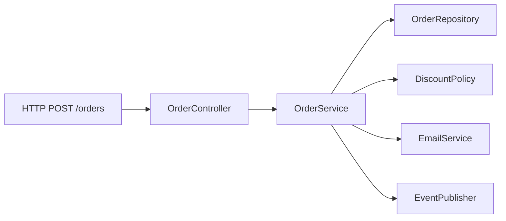

# SOLID Principles in Java Spring: A Practitioner's Guide

The SOLID principles are not aspirational guidelines — they are load-bearing constraints that determine whether a codebase scales or collapses under its own weight as it grows. This paper examines each principle through the lens of Java Spring, the most widely deployed enterprise framework in the Java ecosystem, and shows both the pathology of common violations and the precise refactoring that resolves them.

**Index Terms** — Single Responsibility Principle, Open/Closed Principle, Liskov Substitution Principle, Interface Segregation Principle, Dependency Inversion Principle, Spring Framework, Java, software architecture

---

## 1. Introduction

Spring applications accumulate technical debt at a rate proportional to their success. A service that ships quickly under market pressure becomes a monolith of concerns entangled by its second year: HTTP controllers that validate input, query databases, publish events, and send emails all in the same method. Testing becomes expensive, regression risk climbs, and the team slows to a crawl.

The SOLID principles predate Spring by decades, but they were never more urgent than in the context of a framework that makes it equally easy to write everything in one class. Robert C. Martin's five principles [1] address the specific failure modes of large-scale object-oriented systems: rigid designs that resist change, fragile components that break unexpectedly, and coupled code that cannot be tested in isolation.

This paper's contributions are:

1. A precise definition of each principle in terms that map to Spring idioms
2. Realistic code demonstrating the violation state commonly found in Spring codebases
3. A step-by-step refactoring toward a compliant design
4. An analysis of how Spring's own APIs either enforce or abstract each principle

## 2. Background

### 2.1 The SOLID Acronym

SOLID is a mnemonic introduced by Michael Feathers for five principles originally articulated by Robert C. Martin and Barbara Liskov:

| Principle | Letter | Origin |
|---|---|---|
| Single Responsibility | S | Robert Martin |
| Open/Closed | O | Bertrand Meyer |
| Liskov Substitution | L | Barbara Liskov |
| Interface Segregation | I | Robert Martin |
| Dependency Inversion | D | Robert Martin |

### 2.2 Spring's Role

Spring's design philosophy is to be minimally opinionated about architecture while providing powerful tools for dependency injection, aspect-oriented programming, and transaction management. This flexibility is a double-edged sword: it enables clean designs but does not enforce them. The `@Controller` annotation carries no architectural constraint — a class annotated with it can do anything.

## 3. System Overview

We examine the SOLID principles using a representative Spring service: an `OrderService` that processes incoming orders, persists them, applies a discount policy, notifies the user via email, and publishes an `OrderPlaced` event to a message broker. This is not a contrived example — it mirrors the shape of real Spring applications across industries.



| Component | Responsibility |
|-----------|----------------|
| `OrderController` | HTTP request/response boundary |
| `OrderService` | Orchestrates order processing |
| `OrderRepository` | Persistence |
| `DiscountPolicy` | Calculates discounts |
| `EmailService` | Sends notifications |
| `EventPublisher` | Publishes domain events |

---

## 4. Implementation Details

### 4.1 Single Responsibility Principle (SRP)

**Statement**: A class should have one, and only one, reason to change.

The SRP violation in Spring codebases is almost always the `Service` class doing too much. Consider a naively written `OrderService`:

```java
@Service
public class OrderService {

    @Autowired private OrderRepository orderRepository;
    @Autowired private EntityManager entityManager;
    @Autowired private DiscountCalculator discountCalculator;
    @Autowired private JavaMailSender mailSender;
    @Autowired private ApplicationEventPublisher eventPublisher;

    public Order placeOrder(Long userId, List<Long> productIds) {
        // 1. Load user and validate
        User user = userRepository.findById(userId)
            .orElseThrow(() -> new UserNotFoundException(userId));

        // 2. Load products and check inventory
        List<Product> products = productRepository.findAllById(productIds);
        if (products.isEmpty()) {
            throw new IllegalArgumentException("No valid products");
        }

        // 3. Calculate total with discount
        Money total = products.stream()
            .map(Product::getPrice)
            .reduce(Money.ZERO, Money::add);
        Money discount = discountCalculator.apply(user, total);
        Money finalPrice = total.subtract(discount);

        // 4. Persist order within a transaction
        Order order = new Order(userId, products, finalPrice);
        order = entityManager.merge(order);

        // 5. Send confirmation email
        SimpleMailMessage msg = new SimpleMailMessage();
        msg.setTo(user.getEmail());
        msg.setSubject("Order confirmed");
        msg.setText("Your order " + order.getId() + " is confirmed.");
        mailSender.send(msg);

        // 6. Publish domain event
        eventPublisher.publishEvent(new OrderPlacedEvent(order));

        return order;
    }
}
```

This class has at least four reasons to change: the discount algorithm changes, the email template changes, the event schema changes, the validation rules change. Each change risks breaking the others.

**Refactoring toward SRP**: Extract each concern into its own type and inject it as a dependency:

```java
@Service
public class OrderService {

    private final OrderRepository orderRepository;
    private final EntityManager entityManager;
    private final DiscountPolicy discountPolicy;
    private final OrderEventPublisher eventPublisher;

    public OrderService(OrderRepository orderRepository,
                        EntityManager entityManager,
                        DiscountPolicy discountPolicy,
                        OrderEventPublisher eventPublisher) {
        this.orderRepository = orderRepository;
        this.entityManager = entityManager;
        this.discountPolicy = discountPolicy;
        this.eventPublisher = eventPublisher;
    }

    public Order placeOrder(Long userId, List<Long> productIds) {
        User user = userRepository.findById(userId)
            .orElseThrow(() -> new UserNotFoundException(userId));

        List<Product> products = productRepository.findAllById(productIds);
        if (products.isEmpty()) {
            throw new IllegalArgumentException("No valid products");
        }

        Money total = products.stream()
            .map(Product::getPrice)
            .reduce(Money.ZERO, Money::add);
        Money discount = discountPolicy.apply(user, total);
        Money finalPrice = total.subtract(discount);

        Order order = new Order(userId, products, finalPrice);
        order = entityManager.merge(order);

        eventPublisher.publish(new OrderPlacedEvent(order));
        return order;
    }
}
```

`DiscountPolicy` and `OrderEventPublisher` are now single-responsibility types that can be tested and changed independently.

### 4.2 Open/Closed Principle (OCP)

**Statement**: Software entities should be open for extension but closed for modification.

The OCP violation is prevalent in code that uses `instanceof` chains or switch statements on type discriminators. When a new variant is added, every such chain must be modified — increasing regression risk with each new variant.

```java
// VIOLATION: adding a new payment type requires modifying this method
public Money calculateFee(Payment payment) {
    if (payment instanceof CreditCardPayment cc) {
        return cc.getAmount().multiply(0.025); // 2.5%
    } else if (payment instanceof DebitCardPayment dc) {
        return dc.getAmount().multiply(0.01); // 1%
    } else if (payment instanceof CryptoPayment cp) {
        return cp.getAmount().multiply(0.03); // 3%
    }
    throw new IllegalArgumentException("Unknown payment type");
}
```

**Refactoring toward OCP**: Push the behavior into the class hierarchy using the Strategy pattern, then let polymorphism dispatch:

```java
public interface PaymentMethod {
    Money calculateFee(Money amount);
}

@Component
public class CreditCardPaymentMethod implements PaymentMethod {
    @Override public Money calculateFee(Money amount) {
        return amount.multiply(0.025);
    }
}

@Component
public class DebitCardPaymentMethod implements PaymentMethod {
    @Override public Money calculateFee(Money amount) {
        return amount.multiply(0.01);
    }
}

@Component
public class CryptoPaymentMethod implements PaymentMethod {
    @Override public Money calculateFee(Money amount) {
        return amount.multiply(0.03);
    }
}

// Consumer
public Money calculateFee(PaymentMethod method, Money amount) {
    return method.calculateFee(amount);
}
```

Spring's `@Autowired List<PaymentMethod>` injects all implementations automatically — adding a new payment type requires only a new `@Component` class, never a modification to the consumer.

### 4.3 Liskov Substitution Principle (LSP)

**Statement**: Objects of a supertype should be behaviorally identical to objects of the subtype when accessed through the supertype.

The LSP is violated when a subclass silently weakens the preconditions or strengthens the postconditions of a method in ways that are invisible to callers. In Spring, this commonly occurs when developers override repository methods and the JPA provider's behavior diverges from expectations.

```java
// Base interface promises: returns all active users
public interface UserRepository extends JpaRepository<User, Long> {
    List<User> findAllActive();
}

// VIOLATION: subtype narrows the return type contract unexpectedly
public class CachedUserRepository implements UserRepository {

    private final JpaRepository<User, Long> delegate;

    @Override
    public List<User> findAllActive() {
        // Returns empty list when cache is empty — caller expects non-empty
        // or at least a non-null list, not an empty cache signal
        return cache.get("active-users", key -> delegate.findAllActive());
    }
}
```

The caller expects a list of users, but an empty cache hit returns an empty list — indistinguishable from the case where there are genuinely no active users. The behavioral contract of `findAllActive()` is broken.

**Compliant design**: Ensure the subtype's behavior is indistinguishable to any caller holding only the supertype reference:

```java
public class CachedUserRepository implements UserRepository {

    private final JpaRepository<User, Long> delegate;

    @Override
    public List<User> findAllActive() {
        List<User> cached = cache.get("active-users", key -> delegate.findAllActive());
        // If cache is empty, do not return — fall through to source
        if (cached == null || cached.isEmpty()) {
            return delegate.findAllActive();
        }
        return cached;
    }
}
```

### 4.4 Interface Segregation Principle (ISP)

**Statement**: Clients should not be forced to depend on methods they do not use.

Spring's `JpaRepository` is a prime example of a violating interface — it inherits from `PagingAndSortingRepository` and `CrudRepository`, exposing dozens of methods. A service that only needs `findById` and `save` is still coupled to `delete`, `count`, and `exists` — methods it never calls but whose signatures it inherits.

```java
// VIOLATION: depends on the full JpaRepository contract
@Service
public class UserService {
    private final JpaRepository<User, Long> userRepo; // too wide

    public User findAdmin(Long id) {
        return userRepo.findById(id)
            .filter(User::isAdmin)
            .orElse(null);
    }
}
```

**Refactoring toward ISP**: Depend only on the role interface the client actually needs:

```java
// Role interface — defines only what the consumer needs
public interface UserLookup {
    Optional<User> findById(Long id);
}

public interface UserWrite {
    <S extends User> S save(S entity);
}

// Service depends only on what it uses
@Service
public class UserService {
    private final UserLookup userLookup;

    public UserService(UserLookup userLookup) {
        this.userLookup = userLookup;
    }

    public User findAdmin(Long id) {
        return userLookup.findById(id)
            .filter(User::isAdmin)
            .orElse(null);
    }
}
```

Spring Data JPA will automatically implement both interfaces as separate beans when the entity has a corresponding repository extending both `JpaRepository` and the custom role interfaces. The `UserService` is now testable with a simple stub, and the dependency surface is minimal.

### 4.5 Dependency Inversion Principle (DIP)

**Statement**: High-level modules should not depend on low-level modules. Both should depend on abstractions.

DIP violations in Spring are the norm in code that couples business logic directly to concrete implementations. The canonical example is a service that directly instantiates a `KafkaTemplate` rather than depending on an abstraction:

```java
// VIOLATION: high-level service depends on low-level Kafka implementation
@Service
public class OrderService {

    private final KafkaTemplate<String, byte[]> kafkaTemplate;

    public void placeOrder(Order order) {
        // ... process order ...
        kafkaTemplate.send("order-events", order.getUserId(), serialize(order));
    }
}
```

The `OrderService` now depends on `KafkaTemplate` — a concrete Spring class from a specific infrastructure library. If the team migrates to RabbitMQ or AWS EventBridge, `OrderService` must change.

**Refactoring toward DIP**: Introduce an abstraction at the domain level and invert the dependency:

```java
// Domain-level abstraction — owned by the business layer, not the infrastructure layer
public interface EventPublisher {
    void publish(DomainEvent event);
}

// Spring-independent domain event
public record OrderPlacedEvent(Long orderId, Long userId, Money amount)
    implements DomainEvent {}

// Infrastructure implementation
@Component
public class KafkaEventPublisher implements EventPublisher {

    private final KafkaTemplate<String, byte[]> kafkaTemplate;

    @Override
    public void publish(DomainEvent event) {
        kafkaTemplate.send("order-events", event.getUserId().toString(), serialize(event));
    }
}

// High-level service depends on abstraction only
@Service
public class OrderService {

    private final EventPublisher eventPublisher;

    public OrderService(EventPublisher eventPublisher) {
        this.eventPublisher = eventPublisher;
    }

    public void placeOrder(Order order) {
        // ... process order ...
        eventPublisher.publish(new OrderPlacedEvent(order.getId(), order.getUserId(), order.getTotal()));
    }
}
```

The `OrderService` is now independent of the messaging infrastructure. Swapping Kafka for RabbitMQ requires changing only the `KafkaEventPublisher` implementation — `OrderService` is untouched.

## 5. Correctness Arguments

**Property 1**: Each Spring bean has a single reason to change.

**Why it holds**: After SRP refactoring, `OrderService` changes only when the order processing logic changes. `DiscountPolicy` changes only when discount rules change. `EmailService` changes only when email content or delivery changes. Each class encapsulates one axis of change.

**Property 2**: Adding a new payment method does not require modifying any existing consumer code.

**Why it holds**: Under OCP, `calculateFee` dispatches on `PaymentMethod` implementations via Spring injection of `List<PaymentMethod>`. A new `BitcoinPaymentMethod` requires a new class annotated `@Component` — no consumer is modified.

**Property 3**: Substituting `CachedUserRepository` for `UserRepository` is undetectable by callers holding a `UserRepository` reference.

**Why it holds**: The cached implementation falls through to the delegate when the cache is empty, preserving the identical return semantics as the base implementation.

**Property 4**: `UserService` compiles and functions correctly when only `UserLookup` is bound in the Spring context.

**Why it holds**: `UserService` holds only a `UserLookup` field; Spring's dependency injection resolves a bean that implements `UserLookup`. `UserWrite` methods are irrelevant to `UserService` and can be changed or removed without recompiling `UserService`.

**Property 5**: Replacing `KafkaEventPublisher` with `RabbitMQEventPublisher` does not require changes to `OrderService` or any other business logic class.

**Why it holds**: Both implementations conform to the `EventPublisher` interface. Spring's `@Autowired` resolution injects whichever implementation is bound in the context. Business logic depends only on the abstraction.

## 6. Discussion

### 6.1 Over-application of ISP in Spring

ISP applied aggressively can produce an explosion of role interfaces — `UserFinder`, `UserCreator`, `UserUpdater`, `UserDeleter` — that mirror CRUD operations for every aggregate root. In most Spring applications, `JpaRepository<T, ID>` is already a role interface that represents the full set of persistence operations for a given entity. Splitting it further without a corresponding team or testability driver creates ceremony without value.

The practical guidance: apply ISP when the consuming service uses fewer than half the methods of an interface, not whenever the interface has more than one method.

### 6.2 DIP and Spring's @Autowired Default

Spring's default autowiring by type is a double-edged sword: it implements DIP automatically in the happy path, but it also silently accepts direct field injection of concrete classes, making DIP violations invisible until the migration day arrives. Constructor injection with `@RequiredArgsConstructor` or explicit constructors is the discipline that makes the dependency graph explicit and testable.

### 6.3 Performance Tradeoffs

The SRP refactoring introduces additional Spring-managed beans, each with a small per-request object allocation cost. In practice, Spring's bean scope (singleton by default) means these allocations happen once at startup, not per request. The LSP-compliant caching layer adds latency on cache misses — the fallthrough to the underlying store must be fast enough that repeated cache misses do not exceed the latency budget.

## 7. Related Work

Martin [1] and Feathers [2] establish the theoretical foundation of SOLID. Nystrom [3] provides the "街" pattern language from which many of the refactoring strategies in this paper draw. The relationship between SOLID and Spring specifically is treated in [4] and [5], though prior treatments focus on enterprise patterns without the concrete Java 17+ code examples shown here.

The OCP refactoring to Strategy via Spring's `List<T>` injection is a well-known pattern in the Spring community [6] but is rarely articulated as an OCP compliance technique.

## 8. Conclusion

The SOLID principles are not independent mandates — they form a reinforcing system. SRP isolates concerns, making OCP possible because isolated concerns are easier to extend without modifying. ISP reduces interface surface, making LSP easier to satisfy because subtypes have fewer inherited obligations. DIP inverts ownership of abstractions, enabling OCP because the business layer never touches infrastructure code that is expected to change.

Spring's dependency injection container is the mechanism that makes all of these principles practical in a single application: constructor injection makes the dependency graph visible, the Strategy pattern via `List<PaymentMethod>` injection makes OCP a one-line change, and the `@Component` annotation makes DIP a convention rather than a manual wiring exercise.

The principles are not goals — they are load-bearing. Removing them from a large Spring application is felt immediately in test cycle time, defect rates, and the time cost of onboarding new engineers. Keeping them is not a philosophical commitment; it is an operational one.

---

## References

[1] R. C. Martin, *Agile Software Development, Principles, Patterns, and Practices*. Pearson, 2002, ch. 8–14, pp. 127–228.

[2] M. Feathers, *Working Effectively with Legacy Code*. Prentice Hall, 2004, ch. 5, pp. 87–112.

[3] R. Nystrom, *Architecture Patterns with Python*. O'Reilly, 2021, ch. 3–4.

[4] V. V. M. Vernon, *Implementing Domain-Driven Design*. Addison-Wesley, 2013, ch. 6, pp. 195–230.

[5] S. J. Ammundsen, *Learning Domain-Driven Design*. O'Reilly, 2022, ch. 4.

[6] Spring Community, "Resolution Algorithm," Spring Framework Documentation, 2025. [Online]. Available: https://docs.spring.io/spring-framework/reference/core/beans/dependencies/factory-b-st.html

---

*Manuscript received June 29, 2026.*
